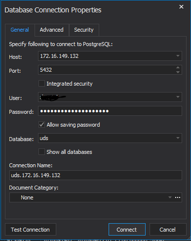

# try-emap
Welcome to UCLH's Data Science Desktop. This is a short guide to getting up and running with data science in R. We will get your tool kit ready including R, RStudio, and version control. We will then explore EMAP using dbForge and RStudio through a couple of brief vignettes.

## Setting up R

See the example `.Rprofile` and `.Renviron` files in `example-config-files`. The former just sets the CRAN mirror, and can be a good place to create paths to local installs for R packages. The latter is a good place to store local usernames and passwords, but make sure that you exclude it from version control.

## Setting up git

Git-Bash and SourceTree are both available. You may need to set-up the http.proxy. This can either be done inside the options of SourceTree, or by writing your own '~/.gitconfig' using the example file. Git needs the proxy addresses in the .gitconfig file to work. You can check this using `git config --global --list`.

## Setting up DBForge

The first time you start using this it will ask you to activate the product. Don't! It works just fine in the trial, and then the free version. You need to set-up a connection to the UDS.

## Putting it all together

Let's log on to the UDS ...
